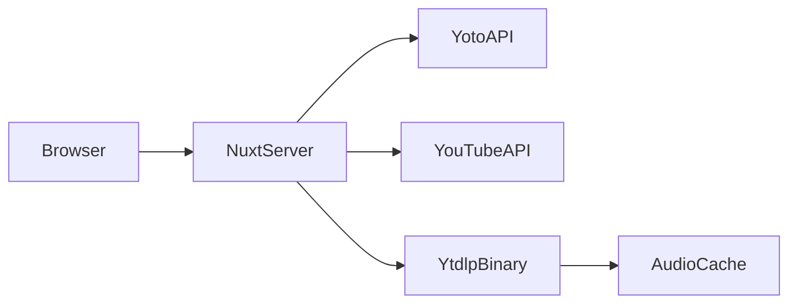

# yoto-cards

Search YouTube, arrange a playlist, and save it to your [Yoto](https://yotoplay.com/) Make Your Own (MYO) cards.

Self-hosted **Nuxt** server app — Yoto OAuth and YouTube audio download run on the server. A static export cannot power those flows.

[Self-host](#self-host) · [Native development](#native-development) · [Contributing](CONTRIBUTING.md) · [Demo runbook](docs/DEMO.md)

## Features

- Search YouTube and preview audio (server-side via yt-dlp)
- Browse and select your Yoto MYO cards
- Drag-and-drop playlist editing
- Save playlists to Yoto with download / transcode progress

## Architecture



| Piece | Role |
|-------|------|
| Nuxt 4 | UI + API routes |
| yt-dlp | YouTube audio for preview and save |
| ffmpeg | Audio extraction on save (`yt-dlp -x`) |
| Yoto OAuth | Public PKCE client; tokens in httpOnly cookies |

## Quick start (Docker)

```bash
git clone https://github.com/stuartromanek/louis.git yoto-cards
cd yoto-cards
cp .env.example .env
# Fill in NUXT_YOTO_CLIENT_ID and NUXT_YOUTUBE_API_KEY (see below)
docker compose up -d --build
```

Requires [Docker Compose V2](https://docs.docker.com/compose/) (`docker compose`). If you only have the standalone binary, use `docker-compose` instead.

Open [http://localhost:4000](http://localhost:4000). Health: `GET /api/health`.

## Self-host

### 1. Yoto developer portal

Create a **public** client at [yoto.dev](https://yoto.dev/get-started/start-here/):

| Setting | Value |
|---------|--------|
| Redirect URI | `https://your-domain/api/yoto/auth/callback` |
| Local redirect | `http://localhost:4000/api/yoto/auth/callback` |
| Scopes | `user:content:view user:content:manage` |

You only need `NUXT_YOTO_CLIENT_ID`. Leave `NUXT_YOTO_CLIENT_SECRET` empty for PKCE.

### 2. YouTube API

Enable **YouTube Data API v3** in Google Cloud Console and create an API key.

### 3. Environment

Copy [`.env.example`](.env.example). Use **`NUXT_*` names** so the same file works for local dev, `docker compose`, and `docker run --env-file .env` without rebuilding the image.

| Variable | Required | Notes |
|----------|----------|-------|
| `NUXT_YOTO_CLIENT_ID` | Yes | Public client ID |
| `NUXT_YOTO_CLIENT_SECRET` | No | Leave empty for PKCE |
| `NUXT_YOTO_REDIRECT_URI` | Production | Must match the portal; local/dev can auto-detect from the request host |
| `NUXT_YOUTUBE_API_KEY` | Yes | Server-side only |
| `NUXT_AUDIO_WORK_DIR` | No | Default `/data/audio` in Docker |
| `NUXT_AUDIO_JOB_MAX_AGE_MS` | No | Stale `jobs/` cleanup (default 1h) |
| `NUXT_AUDIO_CACHE_MAX_AGE_MS` | No | Cache file TTL (default 14d) |
| `NUXT_AUDIO_CACHE_MAX_BYTES` | No | Combined preview + save cache cap (default 5 GiB) |
| `NUXT_YTDLP_PATH` | No | Docker ships `yt-dlp` on `PATH` |
| `NUXT_PUBLIC_DEMO_MODE` | No | `true` shows the demo banner ([docs/DEMO.md](docs/DEMO.md)) |
| `NUXT_ENABLE_DEBUG_ROUTES` | No | `true` enables debug API routes |

**ffmpeg** is required for save. The Docker image installs it.

```bash
docker run -p 4000:4000 --env-file .env yoto-cards:local
```

### 4. Deploy constraints

- **Single instance** — save-job progress is in memory
- **HTTPS in production** — OAuth cookies set `secure` when `NODE_ENV=production`
- **Persistent disk** — recommended for the audio cache under `NUXT_AUDIO_WORK_DIR` (`cache/preview/`, `cache/save/`). Stale `jobs/` dirs and old cache files are swept on startup and after downloads.

## Native development

```bash
npm install
cp .env.example .env
# Install yt-dlp and ffmpeg on your PATH
npm run dev
```

Dev server: port **4000**.

Prerequisites:

- Node.js 22+ (also used as yt-dlp’s JS runtime for YouTube signing; Docker already includes Node)
- [yt-dlp](https://github.com/yt-dlp/yt-dlp) — keep it current; YouTube breaks outdated extractors
- [ffmpeg](https://ffmpeg.org/) — required for save

Production without Docker:

```bash
npm run build
npm run start
```

## Demo instance

Maintainers can run a public demo from [`.env.demo.example`](.env.demo.example) and [docs/DEMO.md](docs/DEMO.md) (separate Yoto public client + `NUXT_PUBLIC_DEMO_MODE=true`).

Self-hosters should **not** reuse demo credentials — register your own Yoto app (BYOK).

## License & notices

MIT — see [LICENSE](LICENSE).

Fonts (Dongle) and OpenMoji icons are bundled; see [THIRD_PARTY_NOTICES.md](THIRD_PARTY_NOTICES.md). Optional UI sounds: [public/sound/README.md](public/sound/README.md).

Security reports: [SECURITY.md](SECURITY.md).
