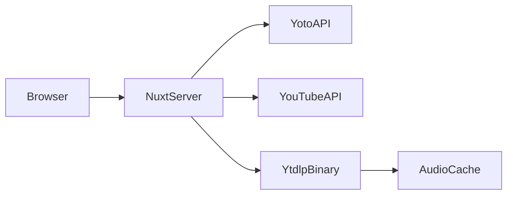

# yoto-cards

Build Yoto Make Your Own (MYO) playlists from YouTube search — preview tracks, arrange a playlist, and save to your Yoto cards.

**[Live demo](https://demo.example.com)** *(update URL after deploy)* · [Self-host](#self-host) · [Demo runbook](docs/DEMO.md)

## Features

- Search YouTube and preview audio (server-side via yt-dlp)
- Browse and select your Yoto MYO cards
- Drag-and-drop playlist editing
- Save playlists to Yoto with transcoding progress

## Architecture



This is a **self-hosted Nuxt server app**. A static export cannot run the YouTube download or Yoto OAuth flows.

| Component | Role |
|-----------|------|
| Nuxt 4 server | UI + API routes |
| yt-dlp | YouTube audio download (preview + save) |
| ffmpeg | Audio extraction for save (`yt-dlp -x`) |
| Yoto OAuth | Public PKCE client; tokens in httpOnly cookies |

## Quick start (Docker — recommended)

```bash
git clone <repo-url>
cd yoto-cards
cp .env.example .env
# Edit .env — see configuration below
docker compose up -d --build
```

Requires [Docker Compose V2](https://docs.docker.com/compose/) (`docker compose`). If you only have the standalone binary, use `docker-compose` instead.

Open `http://localhost:4000`.

Health check: `GET /api/health`

## Self-host

### 1. Yoto developer portal

Create a **public** client at [yoto.dev](https://yoto.dev/get-started/start-here/):

- **Redirect URI**: `https://your-domain/api/yoto/auth/callback` (and `http://localhost:4000/api/yoto/auth/callback` for local dev)
- **Scopes**: `user:content:view user:content:manage`

You only need `NUXT_YOTO_CLIENT_ID`. Leave `NUXT_YOTO_CLIENT_SECRET` empty for PKCE.

### 2. YouTube API

Enable **YouTube Data API v3** in Google Cloud Console and create an API key.

### 3. Environment variables

See [`.env.example`](.env.example). Use **`NUXT_*` names** so the same `.env` works for local dev, `docker compose`, and `docker run --env-file .env` without rebuilding the image.

| Variable | Required | Notes |
|----------|----------|-------|
| `NUXT_YOTO_CLIENT_ID` | Yes | Public client ID |
| `NUXT_YOTO_CLIENT_SECRET` | No | Empty for PKCE (recommended) |
| `NUXT_YOTO_REDIRECT_URI` | Production | Must match portal; dev auto-detects from request host |
| `NUXT_YOUTUBE_API_KEY` | Yes | Server-side only |
| `NUXT_AUDIO_WORK_DIR` | No | Default `/data/audio` in Docker |
| `NUXT_AUDIO_JOB_MAX_AGE_MS` | No | Delete stale `jobs/` dirs older than this (default 1h) |
| `NUXT_AUDIO_CACHE_MAX_AGE_MS` | No | Delete cache files older than this (default 14d) |
| `NUXT_AUDIO_CACHE_MAX_BYTES` | No | Max combined preview+save cache size (default 5 GiB) |
| `NUXT_YTDLP_PATH` | No | Docker includes `yt-dlp` on PATH |
| `NUXT_PUBLIC_DEMO_MODE` | No | `true` for demo banner (see [docs/DEMO.md](docs/DEMO.md)) |
| `NUXT_ENABLE_DEBUG_ROUTES` | No | `true` to enable debug API routes |

**ffmpeg** must be available for save. The Docker image installs it automatically.

Plain `docker run` example (after `docker build`):

```bash
docker run -p 4000:4000 --env-file .env yoto-cards:local
```

### 4. Deploy constraints

- **Single instance** — save job progress is stored in memory
- **HTTPS in production** — OAuth cookies use `secure` in production
- **Persistent disk** — recommended for audio preview cache (`NUXT_AUDIO_WORK_DIR`). Cache lives under `cache/preview/` and `cache/save/`; stale `jobs/` dirs and old cache files are swept on startup and after downloads (see `NUXT_AUDIO_CACHE_*` / `NUXT_AUDIO_JOB_MAX_AGE_MS`).

### Native development (without Docker)

```bash
npm install
cp .env.example .env
# Install yt-dlp and ffmpeg on your system
npm run dev
```

Dev server runs on port **4000**.

Prerequisites:

- Node.js 22+ (also used as yt-dlp’s JS runtime for YouTube signing / anti-bot; Docker already includes Node)
- [yt-dlp](https://github.com/yt-dlp/yt-dlp) on `PATH` (keep it current — YouTube breaks outdated extractors; downloads also retry with alternate `player_client`s)
- [ffmpeg](https://ffmpeg.org/) on `PATH` (required for save)

Production:

```bash
npm run build
npm run start
```

## Demo instance

Maintainers can host a public demo using [`.env.demo.example`](.env.demo.example) and [docs/DEMO.md](docs/DEMO.md). The demo uses a separate Yoto public client and `NUXT_PUBLIC_DEMO_MODE=true` for a UI banner.

Self-hosters should **not** use the demo credentials — register your own Yoto app (BYOK).

## Optional assets

Fonts (Dongle) and OpenMoji SVG icons are bundled in the repository. See [THIRD_PARTY_NOTICES.md](THIRD_PARTY_NOTICES.md).

Optional UI sounds in `public/sound/` — see [public/sound/README.md](public/sound/README.md).

## License

MIT — see [LICENSE](LICENSE).
